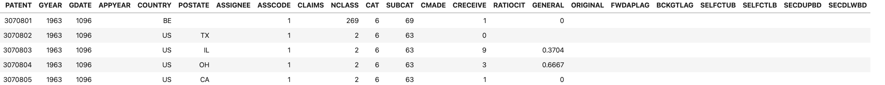
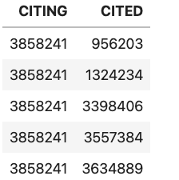

# Assignment -- CSCI 3287 - Queries Using Sub-Queries, With and Raw Joins

## Objectives:

This lab is designed to have you build a relatively complex query in three different ways - buliding up using subqueries, using `WITH` and just joins.

## Datasets

We'll be usng a patent and citation database (see
[http://data.nber.org/patents](http://data.nber.org/patents) for documentation).

The `patents` table contains the patent number, an (optional)
state in which the patent is filed and the total number of citations
made.

The citation database contains pairs of patent numbers, of the form

where both CITING and CITED are integers representing patent numbers. Each line
indicates that patent number CITING cites patent CITED.

Your job is augment the data in
patents to include a column indicating the number of patents
  cited that originate from the same state. Obviously, this data can
  only be calculated for patents that have originating state information
  and only for cited patents that provide that information.

To do this, you will first need do a "data join” of the citations and the patent data - for each cited patent, you'll need to determine the state of the cited patent.

See [the starter code](HW-query.ipynb) for more details.